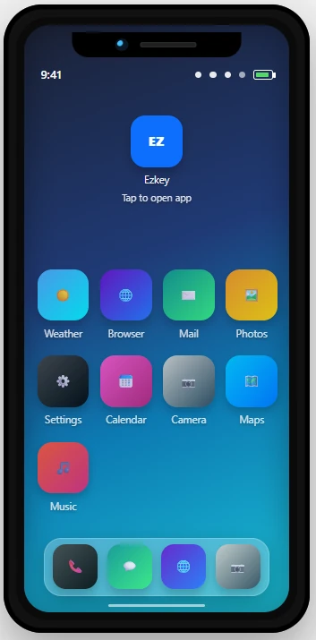

# Ezkey Demo Device

Standalone Spring Boot app: the **Demo Device** virtual phone for Ezkey. Use it to demo device-side enrollment and authentication against a running Ezkey **Auth API**.



## Run with Docker only (recommended for demos)

**Prerequisite:** [Docker](https://docs.docker.com/get-docker/) (Compose v2). No JDK or Maven required on the host; the image is built inside Docker with **BuildKit** and a Maven cache mount (same idea as the main Ezkey repo).

From the repository root, use whichever launcher you prefer:

| Shell | Command |
| --- | --- |
| Command Prompt | `start` or `start.cmd` |
| Batch | `start.bat` |
| PowerShell | `.\start.ps1` (optional: `-Detach` for background, `-NoCache` to force a clean build) |
| Git Bash / Unix | `./start.sh` (optional: `-d` for detached) |

This maps the app to **http://localhost:3080** (container listens on 8083 internally).

By default, the container uses the **Exp1** Auth API (**https://exp1-auth-api.ezkey.org**). For a **local** clean-start Auth API on your machine, set `EZKEY_AUTH_API_URL=http://host.docker.internal:8080` in a `.env` file (see **`.env.example`**) or export it before Compose.

**Enrollment QR with `authUrl`:** When you import an Admin UI enrollment QR that includes `authUrl` (local stack or Exp1), the demo device routes bind, verify, and auth-attempt calls to that URL for that enrollment — even if the Docker default points at Exp1. Manual ID+token entry without QR still uses the configured default only; no `.env` override is required for the common local-QR + standalone `:3080` workflow.

Stop (foreground run): `Ctrl+C`. If you started detached (`-Detach` / `-d`), run: `docker compose down`.

## Run locally (JDK + Maven)

**Prerequisites:** JDK 25, Maven 3.9+.

### Build

```bash
mvn clean install
```

### Run

```bash
java -jar target/ezkey-demo-device-0.1.0-SNAPSHOT.jar
```

Default HTTP port: **8083**. Point the app at your Auth API base URL (default in `application.properties` is `http://localhost:8080`).

Override via environment variable:

```bash
export EZKEY_AUTH_API_URL=http://localhost:8080
java -jar target/ezkey-demo-device-0.1.0-SNAPSHOT.jar
```

Or set `ezkey.auth.api.url` in `src/main/resources/application.properties` / an external config file.

## License

MIT — see [LICENSE](LICENSE).
